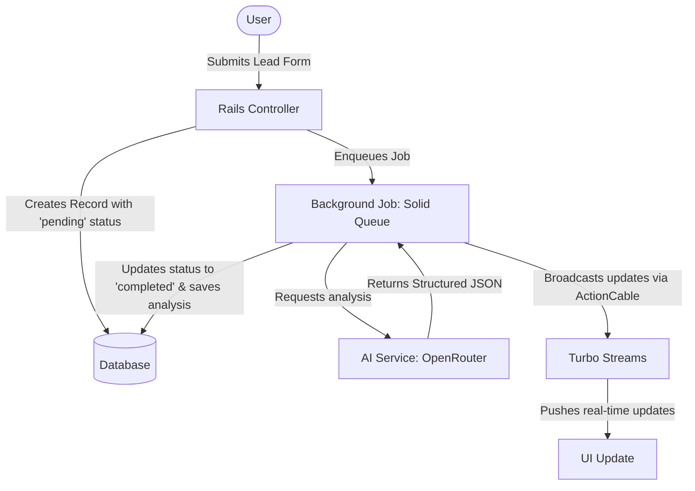

# AI Lead Engine

AI Lead Engine is a Rails 8 application designed to automatically ingest, process, and qualify inbound business leads asynchronously via [OpenRouter](https://openrouter.ai/). 

When a lead is submitted, text analysis is offloaded to a background job that parses the message to extract intent category, urgency level, and a qualification score. Once processed by OpenRouter's LLM backend, the results are broadcasted in real-time to the dashboard using Hotwire/Turbo Streams without requiring a page refresh.

## Project Context

In high-velocity B2B environments, response time directly impacts conversion rates. Standard CRM funnels often delay engagement due to manual lead triage. This project implements a decoupled, production-grade inbound pipeline designed to ingest, score, and qualify leads within seconds of submission, enabling instant routing.

## Business Value

* **Automated Qualification:** Filters out low-intent noise and highlights high-value enterprise targets without manual intervention, accelerating sales cycle velocity.
* **Minimized Lead Response Time (LRT):** Drastically reduces the time between lead submission and sales outreach, directly improving conversion rates.
* **Resource Efficiency:** Eliminates manual triage bottlenecks, ensuring consistent categorization and scoring even during high-traffic spikes.

## System Flow



## Real Example Output

### Sample Form Submission Input
```json
{
  "name": "Sarah Jenkins",
  "email": "sarah.jenkins@enterprise-corp.com",
  "company": "EnterpriseCorp",
  "company_size": "2,500+",
  "message": "Hi, we are currently migrating our legacy infrastructure to AWS and need a secure API gateway partner. We have a budget of $50k/year allocated for this and want to start a POC by next Monday. Please have an enterprise architect call me ASAP at 555-0199."
}
```

### AI Analysis Output
```json
{
  "summary": "Enterprise customer migrating legacy infrastructure to AWS. Needs a secure API gateway. Active budget of $50k/yr, urgent POC start by next Monday, requested phone call from an enterprise architect ASAP.",
  "intent": "hot",
  "score": 95
}
```

## System Design Highlights

* **Asynchronous Execution:** Heavy external API requests are offloaded to `Solid Queue` (Rails' default DB-backed ActiveJob), ensuring HTTP requests remain fast and immune to LLM latency or external downtime.
* **Clean Architecture & Separation of Concerns:**
  - **Service Object (`LeadAnalyzerService`):** Capsule for calling the OpenRouter API, handling formatting, and structured JSON parsing.
  - **ActiveJob (`AnalyzeLeadJob`):** Manages background serialization, state updates, and transactional persistence.
  - **Model Layer (`Lead`):** Manages database state, schemas, and lifecycle validation.
* **Real-time Reactive UI:** Employs Hotwire (Turbo Streams) to push live updates to the client dashboard as soon as the background analysis completes.

## Production Readiness & Resiliency

* **Robust Error Handling & Retries:** Implements automatic retries with exponential backoff to handle transient upstream errors (`5xx`) or temporary rate-limiting (`429`).
* **Queue Throttling:** Configured concurrency limits on the ActiveJob queue prevent overwhelming third-party API rate limits during traffic bursts.
* **Request-Level Cost Control:** Input tokens are constrained through length validation, and system prompts enforce deterministic, low-token responses.
* **Idempotency & State Tracking:** Tracks lead states via atomic database transactions and status markers (`pending`, `analyzing`, `completed`, `failed`), preventing duplicate AI processing on retried jobs.

## Tech Stack

- **Ruby on Rails 8**: Core MVC framework.
- **OpenRouter (`open_router` gem)**: Agnostic LLM gateway interface for flexible model swapping.
- **Turbo Streams**: WebSockets-based real-time frontend updates.
- **Solid Queue**: Database-backed ActiveJob queue adapter.
- **Bootstrap 5 & Importmaps**: Modern, lightweight CSS styling without Node.js tooling dependencies.

## Screenshots

### UI Dashboard Overview


### AI Structured Output Detail


## Setup & Configuration

### Prerequisites
- **Ruby 3.4+**
- **PostgreSQL** or equivalent default DB configured
- OpenRouter API Key

### Installation

1. Clone the repository and install dependencies:
   ```bash
   bundle install
   ```

2. Setup your database:
   ```bash
   rails db:prepare
   ```

### API Keys

You must configure OpenRouter to analyze leads. Set up your OpenRouter API credentials using standard environment variables:

```bash
export OPENROUTER_API_KEY='sk-or-v1-...'
```

*(Alternatively, you can add this securely inside your `credentials.yml.enc` file under `openrouter: api_key`)*

You can optionally configure which model OpenRouter resolves to by setting the `OPENROUTER_MODEL` variable:
```bash
export OPENROUTER_MODEL='openai/gpt-4o-mini'
```

### Running the application

1. Start your background worker and rails server using your preferred process manager (e.g. `bin/dev` or using `foreman` with the Procfile if you have one, or just the unified rails server):
   ```bash
   bin/rails server
   ```
   *(Ensure your background job processor is functioning so that `AnalyzeLeadJob` can execute!)*

2. Open `localhost:3000/leads`
3. Click **"New Lead"** and submit dummy lead information (e.g., "I need urgent digital marketing help!").
4. Watch the list update asynchronously as the lead begins in an *Analyzing...* state, before snapping to the fully analyzed metrics retrieved from the AI model!
