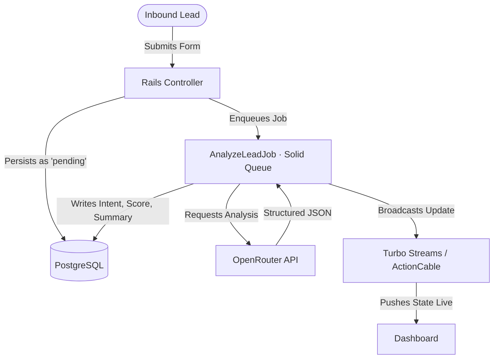

# AI Lead Engine

A real-time backend system for AI-powered lead qualification in SaaS workflows

[](https://rubyonrails.org)
[](https://www.ruby-lang.org)
[](https://hotwired.dev)
[](https://openrouter.ai)

---

## What this is
A Rails-based backend system that processes inbound leads asynchronously and enriches them using LLM-based classification.

---

## Overview

### The Problem
Inbound B2B lead value decays rapidly. Most CRM setups leave submissions unassigned in queues waiting for manual triage, increasing Lead Response Time (LRT) and lowering conversion rates.

### The Solution
AI Lead Engine automates lead triage. It offloads raw submission text to a background worker, classifies intent, scores the lead (1-10), writes a structured summary, and streams updates instantly to the user's dashboard over WebSockets.

---

## System Flow



*By separating ingestion from processing, database writes are fast and immune to upstream LLM latency.*

---

## Real Example Output

### Inbound Form Submission
```json
{
  "name": "Sarah Jenkins",
  "email": "sarah.jenkins@enterprise-corp.com",
  "company": "EnterpriseCorp",
  "company_size": "2,500+",
  "message": "We're migrating legacy infra to AWS and need a secure API gateway partner. $50k/year budget, want a POC by next Monday. Please have an enterprise architect call me ASAP."
}
```

### AI Structured Qualification
```json
{
  "summary": "Enterprise lead migrating to AWS, needs a secure API gateway. $50k/yr budget, POC by next Monday, requesting an architect call ASAP.",
  "intent": "hot",
  "score": 95
}
```

---

## Tech Stack & Architecture

- **Framework:** Ruby on Rails 8
- **Background Jobs:** Solid Queue (Postgres-backed ActiveJob, eliminating Redis dependencies)
- **AI Gateway:** OpenRouter via `open_router` gem (Model-agnostic; default is `openai/gpt-4o-mini`)
- **Real-Time UI:** Hotwire & Turbo Streams over ActionCable (Persistent WebSockets)
- **CSS Framework:** Bootstrap 5 with Importmaps (Zero-Node build step)
- **Testing:** Dual suite support using RSpec (Unit & System) and Minitest (Integration)

---

## Architectural Decisions & Tradeoffs

### 1. Reactive Push vs. Pull
* **Decision:** Push updates to the UI immediately via Turbo Streams over ActionCable WebSockets.
* **Tradeoff:** Increases server memory usage for concurrent WebSockets connections. This is justified because instant visibility on hot leads directly impacts revenue.

### 2. Solid Queue vs. Redis-Backed Sidekiq
* **Decision:** Use Rails 8's database-backed Solid Queue engine.
* **Tradeoff:** Lower maximum job throughput compared to Redis. However, it simplifies the hosting footprint (one less service to monitor), which is ideal since lead ingestion volume rarely hits database write ceilings.

### 3. Model-Agnostic Routing vs. Vendor SDKs
* **Decision:** OpenRouter integration using `OPENROUTER_MODEL`.
* **Tradeoff:** Dependency on an external router. The benefit is flexibility: models can be swapped (e.g., to minimize latency or cost) without modifying application code.

### 4. Idempotent State Machine
* **Decision:** Leads transit through an atomic database enum state (`pending` → `completed` / `failed`).
* **Tradeoff:** Slight database overhead for status updates. This prevents duplicate API calls and double-billing on retry cycles.

---

## Resiliency & Hardening

* **Error Handling:** Employs exponential backoff retries for transient upstream failures (`HTTP 429` and `HTTP 5xx`).
* **Concurrency Throttling:** Queue execution limits throttle outbound LLM requests to avoid hitting rate limits.
* **Cost Controls:** Enforces input length validations and strict system prompts to limit maximum token usage.
* **Observability:** Traceable status states are logged inside transactions. At scale, this would be updated to log correlation IDs and token usage metrics.

---

## Getting Started

### Installation & Run

1. **Install dependencies:**
   ```bash
   bundle install
   ```

2. **Run migrations & setup database:**
   ```bash
   rails db:prepare
   ```

3. **Configure API credentials:**
   ```bash
   export OPENROUTER_API_KEY='sk-or-v1-...'
   export OPENROUTER_MODEL='openai/gpt-4o-mini'
   ```

4. **Boot the server:**
   ```bash
   bin/rails server
   ```

5. **Access the application:**
   Visit `http://localhost:3000/leads` to submit and monitor leads in real-time.

### Running the Test Suite

```bash
# Prepare the database
bin/rails db:test:prepare

# Run unit and system specs
bundle exec rspec

# Run integration tests
bin/rails test
```


## Roadmap

- [ ] **CRM Sync:** Direct push connectors for Salesforce and HubSpot.
- [ ] **Upstream Fallback:** Auto-routing to secondary LLM endpoints on API error.
- [ ] **Multi-Tenancy:** Scoped dashboards and model configuration for multiple teams.
- [ ] **Prompt Optimization:** Feedback loop to refine prompts based on sales close rates.
